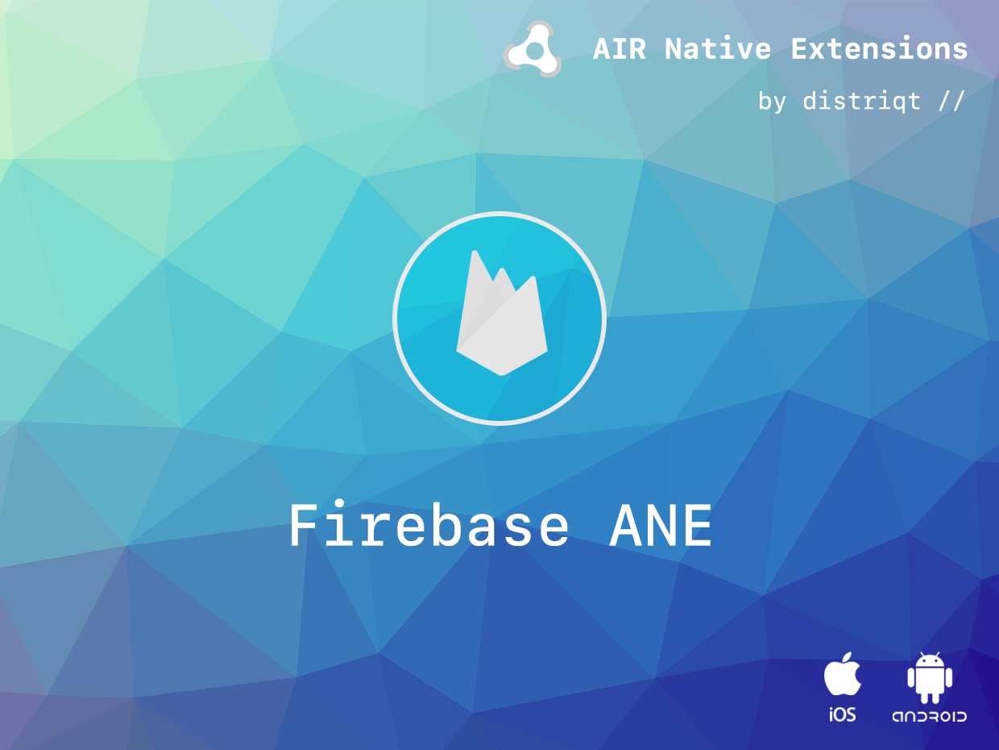

built by [distriqt //](https://airnativeextensions.com) 




# Firebase

The [Firebase platform](https://firebase.google.com) forms one of the biggest 
platforms for application development available today bringing together a range 
of Google services along with the acquired Firebase infrastructure services.

We have been working with Google to bring you the best available ANEs 
integrating Google services tightly with your AIR application.

This extension is to bring access Google's Firebase infrastructure to your AIR application.

The simple API allows you to quickly integrate Firebase in your AIR application. 
Identical code base can be used across all platforms allowing you to concentrate 
on your application and not device specifics.

We provide complete guides to get you up and running with Firebase as quickly and easily as possible.


### Features:

- [Analytics](https://github.com/distriqt/ANE-Firebase/wiki/Core---Introduction)
- Develop
	- [Authentication](https://github.com/distriqt/ANE-Firebase/wiki/Auth---Introduction)
	- [Realtime Database](https://github.com/distriqt/ANE-Firebase/wiki/Database---Introduction)
	- [Storage](https://github.com/distriqt/ANE-Firebase/wiki/Storage---Introduction)
- Quality
	- [Crashlytics](https://github.com/distriqt/ANE-Firebase/wiki/Crashlytics---Introduction)
	- [Performance Monitoring](https://github.com/distriqt/ANE-Firebase/wiki/Performance---Introduction)
	- **Deprecated** [Crash Reporting](https://github.com/distriqt/ANE-Firebase/wiki/Crash---Introduction)
- Grow
	- [Notifications (Cloud Messaging)](https://github.com/distriqt/ANE-Firebase/wiki/FCM---Introduction)
	- [Remote Config](https://github.com/distriqt/ANE-Firebase/wiki/RemoteConfig---Introduction)
	- [Dynamic Links](https://github.com/distriqt/ANE-Firebase/wiki/DynamicLinks---Introduction)
	- [Invites](https://github.com/distriqt/ANE-Firebase/wiki/Invites---Introduction)
- Single API interface - your code works across iOS and Android with no modifications
- Sample project code and ASDocs reference


## Documentation

Latest documentation can be found in the [wiki](https://github.com/distriqt/ANE-Firebase/wiki)

Quick Example: 

```actionscript
Firebase.initialiseApp();

// Log an event to analytics
var event:EventObject = new EventObject();
event.name = EventObject.ADD_TO_CART;
event.params[Params.PRICE] = 1.99;

Firebase.service.analytics.logEvent( event );
```

More information here: 

[com.distriqt.Firebase](https://airnativeextensions.com/extension/com.distriqt.Firebase)


## License

You can purchase a license for using this extension:

[airnativeextensions.com](https://airnativeextensions.com/)

distriqt retains all copyright.


