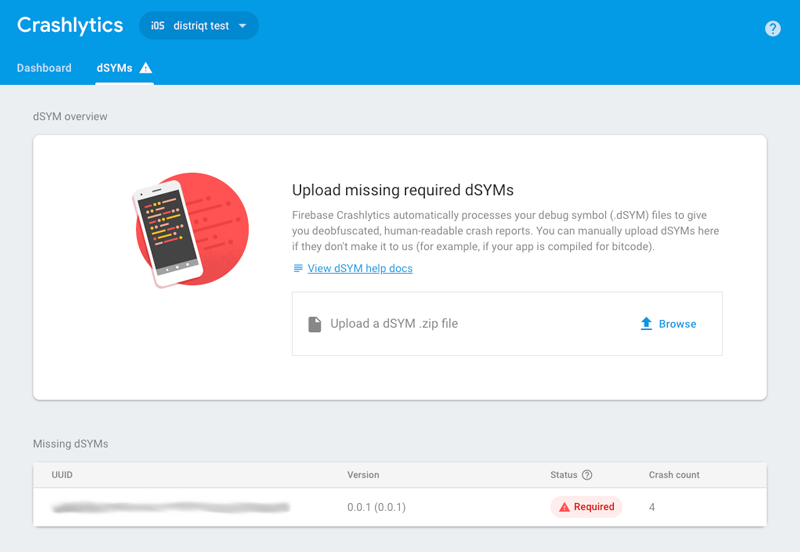

On Android your crash logs will appear in the dashboard in around 5 minutes however you may not see your iOS logs unless you upload the debugging information file generated for your iOS `IPA`. 

All the debug information for your iOS application is contained in a `dSYM` file. 

Firebase Crashlytics automatically processes your debug symbol (`.dSYM`) files to give you deobfuscated, human-readable crash reports. You can manually upload dSYMs through the [console](https://console.firebase.google.com/) if they don't make it to Firebase automatically (for example, if your app is compiled for bitcode).

If you don't upload a `dSYM` for each version of your application there will be a warning displayed in the console and detailed information for any crashes of that version will not be shown in the console.

## Generating a dSYM for your AIR application

..

